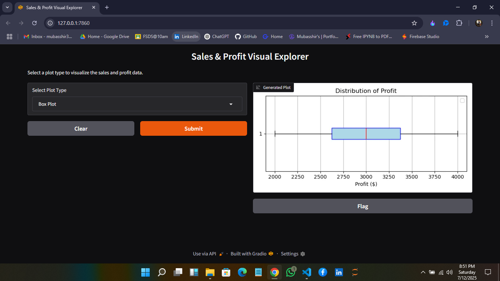

# 📊 Interactive Sales & Profit Dashboard (Matplotlib + Gradio)

An interactive and beginner-friendly **real-time data visualization dashboard** designed using **Matplotlib** and **Gradio**. This project empowers small business owners, data learners, and analysts to **explore monthly sales and profit trends** without the need for complex tools like Excel, Tableau, or Power BI.

---

## 🎯 Project Objective

To create a **lightweight yet powerful dashboard** that enables users to:

- 📈 Choose from multiple chart types (Bar, Line, Pie, Scatter, Box)
- 🔍 Visually compare and analyze monthly sales vs profit
- 🧠 Derive business insights using clear visualizations
- 🌐 Access the dashboard through a browser (local/public URL)

This dashboard was developed by **Mubasshir Ahmed** as part of the **Full Stack Data Science Program @Kodigit**, based on a real-world sales analysis scenario.

---

## 📁 Project Structure

📦 Interactive-SalesDashboard-Matplotlib-Gradio/
├── `MatplotlibXGradio_ImageOutput.ipynb` – Final interactive notebook  
├── `InteractiveDashboard_UseCaseSummary.docx` – Business use case documentation  
├── `GradioUI.png` – Dashboard mockup screenshot  
├── `README.md` – You’re here!  

---

## 🖼️ Dashboard Output (Mockup Preview)

Here’s a preview of what the app looks like when running:



---

## 🧪 Features Showcased

- ✅ Interactive Matplotlib visuals
- ✅ Chart selection dropdown via Gradio
- ✅ Image-based rendering for better compatibility
- ✅ Fast web UI deployment (no frameworks needed)
- ✅ Real-world use case: Retail sales & profit analytics

---

## 📎 Use Case Summary

> “Small business owners face challenges identifying key sales/profit trends.  
> This tool bridges that gap by providing an intuitive chart-based dashboard  
> for data-driven decisions — instantly.”

📄 Read more → [`InteractiveDashboard_UseCaseSummary.docx`](InteractiveDashboard_UseCaseSummary.docx)

---

## 🚀 Getting Started

### 🔧 Requirements

```bash
pip install pandas matplotlib gradio
```

### ▶️ How to Run the App

**Option 1: Jupyter Notebook**  
Open `MatplotlibXGradio_ImageOutput.ipynb` and run all cells.

**Option 2: Python Script**  
Run using:

```bash
python app.py
```

Gradio will open the dashboard in your default browser.

---

## 🌟 Future Enhancements

- 📂 Upload and visualize your own CSV files
- 📊 Auto-calculate business KPIs (max profit, avg sales, etc.)
- ☁️ Deploy publicly using Hugging Face Spaces

---

## 🙋‍♂️ About Me

**Mubasshir Ahmed**  
Aspiring Data Scientist | Full Stack DS @Kodigit  
🔍 Passionate about AI, ML, Data Visualization & Generative Tech  

🔗 LinkedIn | 📘 GitHub: [mubasshirahmed-3712](https://github.com/mubasshirahmed-3712)  

---

### 📌 Final Note

> "Data should speak — not stay hidden in spreadsheets."  

---
